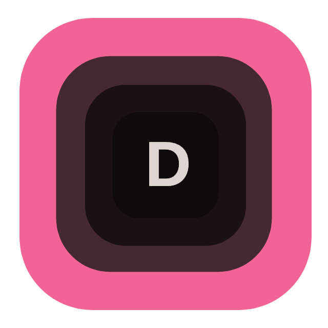
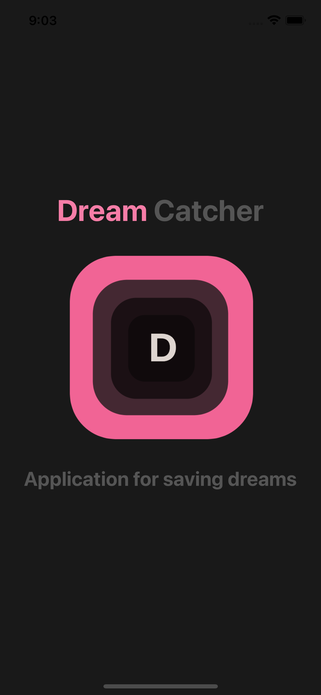
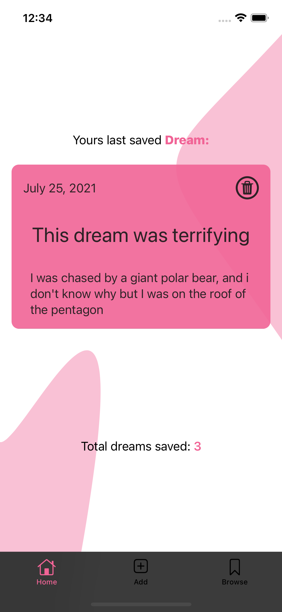
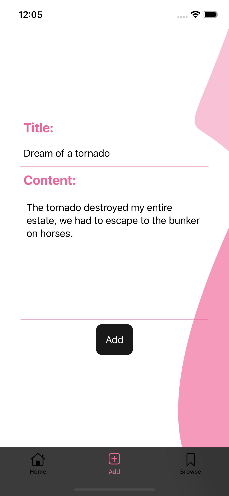
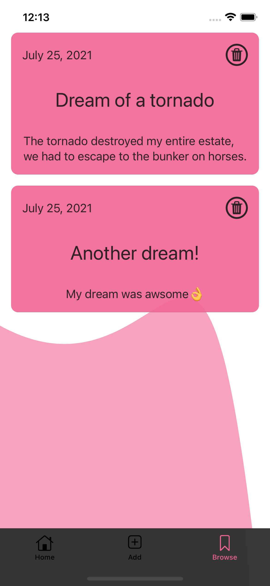

# DreamCatcher

## General info
Native IOS app created for easy and quick saving dreams. Just open app and start adding new dreams, no sign-in, no sign-up. All dreams are stored locally on device and online in firestore so you can use app offline and then synchronize data when there is Internet connection.

## Technologies
Project is created with:
* Swift 5
* SwiftUI
* [Firestore](https://firebase.google.com/docs/firestore)

## Screens from the application

  
Expand

  <h2>Launch screen</h2>
  

    
  

  
  <h2>Home tab</h2>
  

    
    
  

  
  <h2>Add tab</h2>
  

    
  

  
  <h2>Browse tab</h2>
  

    
  

